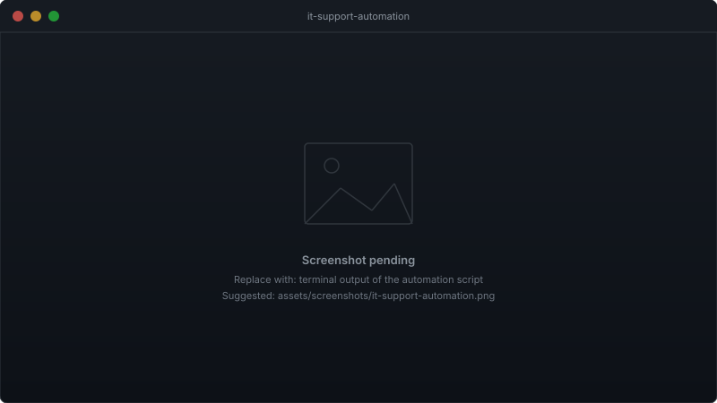
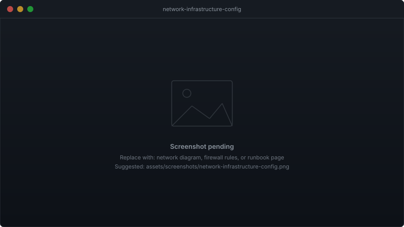
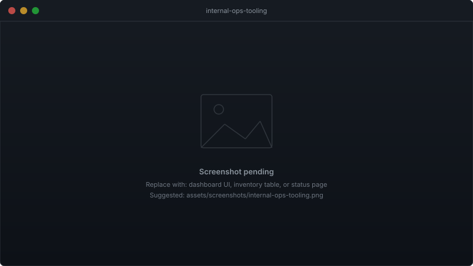

 

 

 

---

I design and operate the systems that keep engineering teams productive — from provisioning servers and managing network infrastructure to building the internal tooling that gives ops teams real-time visibility.

My work sits at the intersection of IT support, infrastructure automation, network operations, and full stack development. I treat documentation and repeatability as non-negotiable: if a process cannot be scripted, reviewed, and handed to someone else, it is not finished.

 

---

## Disciplines

<table>
  <tr>
    <td><b>IT Support &amp; Systems</b></td>
    <td>Tier 1–3 helpdesk · hardware lifecycle · endpoint management · ITSM workflows</td>
  </tr>
  <tr>
    <td><b>Infrastructure Automation</b></td>
    <td>Server provisioning · scripting · CI/CD pipelines · Linux hardening · IaC</td>
  </tr>
  <tr>
    <td><b>Network Operations</b></td>
    <td>TCP/IP · VLANs · routing · firewall policy · VPN · network monitoring</td>
  </tr>
  <tr>
    <td><b>Full Stack Development</b></td>
    <td>REST APIs · web interfaces · databases · ops-focused internal tooling</td>
  </tr>
</table>

 

---

## Tools &amp; Technologies

**Systems &amp; Virtualisation**
`Linux` `Windows Server` `Bash` `PowerShell` `Git`

**Networking**
`TCP/IP` `VLANs` `DNS / DHCP` `Firewalls` `VPN`

**Automation &amp; Observability**
`Shell scripting` `Docker` `GitHub Actions` `Log analysis` `Alerting`

**Full Stack**
`REST APIs` `SQL` `HTML / CSS` `JavaScript`

 

---

## Featured Projects

Most operational work lives in private repositories or internal systems. The projects below represent the categories of work I focus on publicly.

 

**IT Support Automation**

Scripts and tooling built to eliminate repetitive helpdesk tasks — covering user provisioning, asset tracking, and ticket triage. Designed to run unattended and log every action for auditability.

  

[View on GitHub](https://github.com/Kuroshitsuji)

 

**Network &amp; Infrastructure Configuration**

Configuration files, templates, and runbooks for managing network devices, firewall rules, and server baselines. Built to be version-controlled and reviewed before any change reaches production.

  

[View on GitHub](https://github.com/Kuroshitsuji)

 

**Internal Operations Tooling**

Web-based interfaces and APIs built for internal ops use — dashboards, inventory views, and status pages that give non-technical stakeholders visibility without needing terminal access.

  

[View on GitHub](https://github.com/Kuroshitsuji)

 

---

## Activity

  

  

 

  <picture>
    <source
      media="(prefers-color-scheme: dark)"
      srcset="https://raw.githubusercontent.com/Kuroshitsuji/Kuroshitsuji/output/github-contribution-grid-snake-dark.svg"
    />
    <source
      media="(prefers-color-scheme: light)"
      srcset="https://raw.githubusercontent.com/Kuroshitsuji/Kuroshitsuji/output/github-contribution-grid-snake.svg"
    />
    
  </picture>

 

---

## Contact

Open to infrastructure roles, network operations contracts, and full stack positions in ops-focused teams. Reach out via GitHub or connect on LinkedIn.

 

---

  
    IT Support &nbsp;·&nbsp; Infrastructure Automation &nbsp;·&nbsp; Network Operations &nbsp;·&nbsp; Full Stack Development
      
    <i>"Automate the toil. Document the system. Ship reliable things."</i>
      
    
  

